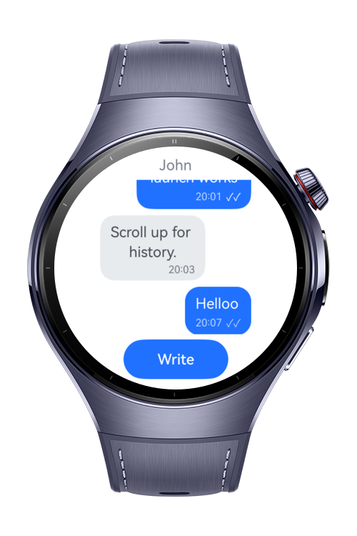
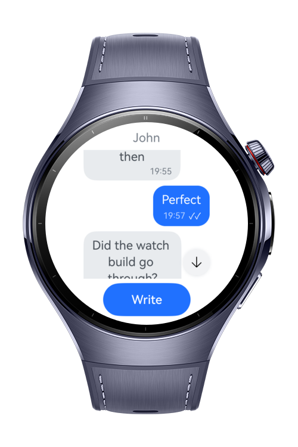
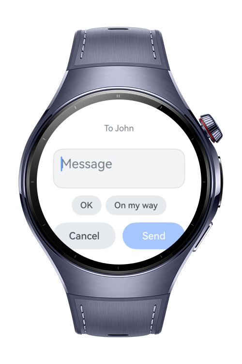
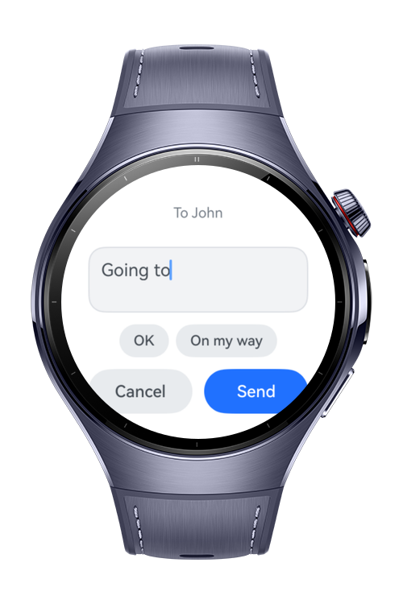

> **Note:** To access all shared projects, get information about environment setup, and view other guides, please visit [Explore-In-HMOS-Wearable Index](https://github.com/Explore-In-HMOS-Wearable/hmos-index).

# How to Build Reverse List

This application demonstrates to build a list component in reverse order. Using the scale function it mirrors the list in both axes so that they are inverted in UI. Custom crown scroll logic is implemented to avoid scale function usage.

# Preview

<div>
  
  
  
  
</div>

# Use Cases

- Invert the scroll logic using `scale` so scroll starts from the bottom of the screen.
- Insert new items to the list at the first position, so that they appear on the bottom.
- Jump to the last message with a button, show it after scrolling to older messages.
- Show a new dialog for sending a new message.

# Technology
## Stack

- **Languages**: ArkTS, ArkUI
- **Frameworks**: HarmonyOS SDK 6.0.1(21)
- **Tools**: DevEco Studio 6.0.1, Hvigor
- **Libraries**:
    - `@kit.ArkUI`
    - `@kit.AbilityKit`

# Directory Structure

```text
entry/src/main/ets/
├─ entryability
|   ├─ EntryAbility.ets
├─ component
|   ├─ MessageBubble.ets
├─ constants
|   ├─ Constants.ets
├─ datasource
|   ├─ MessageDataSource.ets
├─ model
|   ├─ Message.ets
├─ pages
    ├─ Index.ets

entry/src/main/resources/
├─ base
|   ├─ element
|   ├─ media
|   ├─ profile
```

# Constraints and Restrictions

## Supported Device

* Huawei Watch 5
* DevEco Studio wearable simulator

# License

**How to Build Reverse List** is distributed under the terms of the MIT License. See the [LICENSE](LICENSE) for more information